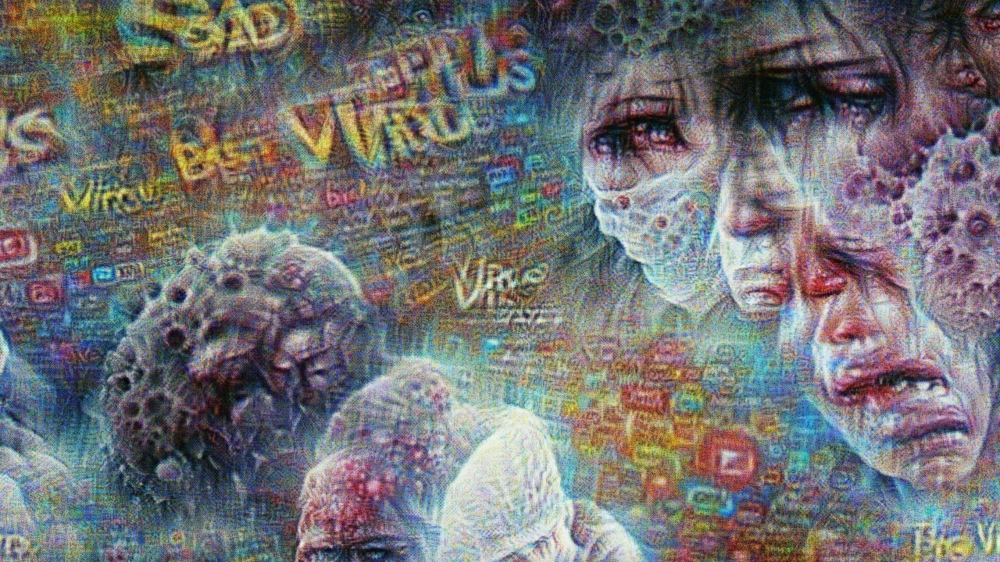

# SentiMo

<h3 align="center">~When feelings can be painted~</h3>

## Inspiration

Everyday, billions of tweets on Twitter are released from our smart devices as we are trying to express our feelings and emotions. This amount of data derived from social media networks lead us to ask ourselves: what if we could use Artificial intelligence (AI) to embody our complaints or feelings about public topics such as COVID-19? How would our emotions look like if we gave the algorithm brushes and paint to draw our sentiment into pieces of art?

## What it does?

SentiMo captures the public sentiments retrieved from Twitter which will illustrate it in an imagination piece of art by using of text-to-video generated by the tweets that is more frequently expressed which we divided into 4 different feelings (Fear, Anger, Joy and Sad). Finally, turn suffering into an audible impact by coding those 4 feelings hormones DNA sequence by convert it into sequences of notes, one by line, composed by their location, octave, the note played, velocity, duration and track. We spot these feelings related to a specific topic (ex. COVID-19) to generate a symphony using a combination of text2audio and dna2audio.

## AI part Description:

We preprocess and analyze English and Arabic tweets. Then, we used the retrieved tweets to generate text2video using Clip+Aphantasia with categorizing them with 4 different feelings (Fear, Anger, Joy and Sad) relying on two styles (Cinematic and Picasso). For the music part, we used text2audio and dna2audio pretrained models to generate audio of DNA hormones sequence for the feelings (Fear, Anger, Joy and Sad) and assign each of them to the generated video part that narrates people's feelings during COVID-19 pandemic.

## Art part Description:

SentiMo takes us through an imagination journey on how people feelings expressed over the COVID-19 period which have been translated into a piece of art and heard as music that embodies people’ suffering.

## How we built it?

We used different models and tools to present our work: natural-language-processing, python, C++, PyTorch, MusicCAN, styleCAN, Clip, GAN, Juypter-notebook, Adobe-after-effects, Adobe-illustrator, and Adobe-premiere-pro.

## What we learned

- Working with sentiment analysis.
- Using pre-trained models for generating videos from text.
- Visualize our work in different artistic ways.

## What's next for SentiMo

- Optimize the generated vedios of SentiMo algorithm.
- Produce more meaningful frames/images on more topics.
- Keep improving and learning more.
